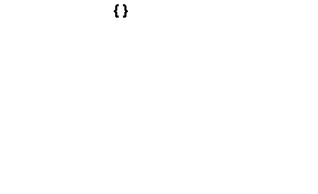

# MaxMiner
Optimized, CPU/GPU parallelizable implementation of Maximum Frequent Itemset Mining

## Maximal Itemsets
A commonly misunderstood aspect of [Association Rule Mining](https://en.wikipedia.org/wiki/Association_rule_learning)(ARM)
is that Association Rules (AR) are the only useful product.


the intermediate product of  required to make the 
are not valuable in a standalone fashion

In fact, AR production requires an intermediate step of Itemset Mining (IM) which can produce
useful products, especially when refined to specific classes such as
[Maximal and CLosed Itemsets](http://eacharya.inflibnet.ac.in/data-server/eacharya-documents/53e0c6cbe413016f23443704_INFIEP_33/85/LM/33-85-LM-V1-S1__maximal_and_closed_itemsets.pdf)

These Itemsets can provide helpful summaries of large portions of high cardinality data, in a
much more performance friendly manner then traditional, bottom-up Frequent Itemset (FI) techniques
such as Apriori.

## Data Preperation

Transaction Data represents two basic challenges for computer processing: overall volume and
arbitrary length.
MaxPriori includes pre-processing steps which attempt to address both of this challenges prior to
running the actual ARM algorithm. 

To overcome this, we employ three optimizations when loading the data into the algorithms: Transaction Encoding, 
Support Filtering and Duplication Counting

### Transaction Encoding
As a general rule computers operate most efficiently over data structures of known, fixed size. 
This matches poorly with transaction data containing an arbitrary number of unique items in 
each row/set.

Transaction Encoding uses a variation of One-Hot Encoding that converts Transaction Data 
into a table of columns containing binary values representing each possible unique value.

The challenge of this technique is that it requires advance knowledge of the cardinality (number of unique) items of a dataset.

This is accomplished in this implementation with a pre-read step that measures length and cardinality
to produce a corresponding data structure and encoder.

In addition to allowing more swift computation, Transaction Encoding also reduces the footprint of
the data in memory.

```
in_data = [
[a,b,c],
[a,b],
[c]
]

out_data = [
[True, True, True],
[True, True, False],
[False, False, True]
]
```

### Support Filtering
Frequency based filtration criterion (typically minimum support ratios) is the most common way of 
reducing Transaction Data to reduce memory footprint and accelerate computation.
Generally these criterion are applied once the data in its entirety has already been loaded into 
memory and is being passed into the ARM algorithm.

This represents an issue when the full data on disk is too large for memory and can destabilize 
the program before filtering.

MaxPriori provides the ability to filter individual Unique Values during the 
de-serialization/encoding process based on Max or Min Support (currently only available on CSV) 
as well as standard Python collections. 

This adds minimal overhead to the normal encoding process because it takes advantage of the 
existing pre-read step to generate the Transaction Encoder.

### Duplication Counting (WIP)
Identical combinations of unique values occurring across Itemsets are relatively common in 
Transaction Data and represent another opportunity to reduce it's memory and processing
footprint.

Taking advantage of this involves generating a secondary hash table that maps to their support.

```
{
{a,b},
{b,a},
{a,c}
}

[
[True, True, False],
[True, False, True]
],

{{'a', 'b'}: 2,
{'a', 'c'}: 1
}

]
```

This is more challenging then it appears because most Transaction storage formats do not require 
ordering values, we must pre-sort values to ensure that we identify all equivalent instances 
(ex. {a,b} == {b,a}).

Taking advantage of this optimization requires special accommodation in the ARM algorithm 
implementations.

## Implemented Algorithms
Closed and Maximal algorithms are generally designed to find closed/maximal sets as early in the
computation as possible and use them to disqualify other sets without having to compute their
support

As Closed Itemsets are a superset of Maximal Itemsets, Closed Algorithms naturally discover Maximal
Itemsets but do not necessarily distinguish them. As such Maximal algorithms are
generally faster and narrower in output due to higher specificity

### CHARM -

The [CHARM Algorithm](https://pdfs.semanticscholar.org/fc59/bb528815efc84c2a08a3ad09f9ced8cc7508.pdf)
is a cousin of MAFIA (also implemented here) designed to find Closed Itemsets.

CHARM is a depth first algorithm that actively pursues instances where subsets-supersets have identical
supports, allowing us to eliminate the former in favor of the latter.


[Demo Video](https://www.youtube.com/watch?v=XTj53ctgFFk/)

### MAFIA - 

The [MAFIA Algorithm](http://himalaya-tools.sourceforge.net/Mafia/) is specifically designed to 
efficiently identify Frequent Maximal Item Sets (FMIs) using a depth-first approach.

The algorithm starts with individual Frequent Items or **Roots**. Then with each round of the algorithm, 
it will assess each of these roots as a potential **Head**, and calculate the **Tail** from the Union
of all other items that appear in transactions with the head.

In the illustration below {1} is a **Root** which will also become the first **Head**, with a **Tail**
of {1,2,3,4}.

The algorthm will then select one of the tail elements ({2} in the example), determine that it is frequent in combination 
with the head (yes), and continue in the same manner.

This process will continue until the algorithm either finds a Head with no frequent Tail elements ({1,2} and {1,3} in the example)
or no Tail elements period ({1,2,3,4} if that were a frequent set in the example).



As per the paper, this implementation of the algorithm uses three optimization techniques to improve
performance

#### Parent Equivalence Pruning (WIP)

This is a simple heuristic which compares the support of subsets and supersets and if they prove
to be identical, treats them as equivalent and compresses the data.

For the example illustration: if {1} has support 5 and {1,2} also has support 5, we'll give up
evaluating {1} as HEAD and concentrate on {1,2} as HEAD and its TAIL items {3,4}.

#### Head Union Tail Maximum Frequent Itemsets (HUTMFI) Superset Pruning

The MAFIA paper provides two similar approaches for using discovered MFIs to prune the search
tree.
As the simpler and most broadly performant choice, HUTMFI is the strategy used in this implementation
of the algorithm.

This optimization works by taking the Union of the HEAD and its TAIL (HUT) in a given round of the algorithm
and comparing them to the MFI list.

If we find the HUT in the MFI, we conclude that the current HEAD can only lead to the already discovered
MFI and cease evaluating it and its TAIL elements.

Note we efficiently compute the TAIL of a given HEAD using the vertical bitmap by filtering transactions 
that contain the HEAD and performing bitwise_or over the columns and selecting those that are True (
meaning they have at least one True value among the transactions).

*Note that the provided MAFIA illustration cannot take advantage of HUTMFI optimization because the MFIs are too short.*
*However if we decrease the minimum support so that the largest superset {1,2,3,4} is frequent, we can.*

In this situation, our depth first search test will:

- Evaluate ROOT {1} as HEAD, determine it is frequent, calculate its TAIL {2,3,4} and move to the first tail element {2}
- Evaluate the HEAD {1,2}, determine it is frequent, calculate its tail {3,4} and move to the first tail element {3}
- Evaluate the HEAD {1,2,3}, determine it is frequent, calculate it's tail {4} and move to the first tail element {4}
- Evaluate the HEAD {1,2,3,4}, determine it is frequent, that is has no tail, mark as MFI and return
- Return to HEAD {1,2,3} note TAIL {4} is already exhausted and return
- Return to head {1,2}, determine the HUT {1,2,3,4} is in the MFI list and return
- Return to head {1}, determine the HUT {1,2,3,4} is in the MFI list and return
- Evaluate the remaining roots {2}, {3}, {4}, compute HUTs (all {1,2,3,4}) find they 
exist in the MFI list and skip

** Vertical Bitmap Representation **

What the paper calls Vertical Bitmap Representation is sometimes called Transaction Encoding and 
is a close cousin of One Hot Encoding.

[Paper](https://angsila.cs.buu.ac.th/~nuansri/DataMining/mafia-camera.pdf)

### FP-MAX

The [FP-MAX](http://users.encs.concordia.ca/~grahne/papers/hpdm03.pdf) algorithm

### Others
MaxMiner - https://www.cs.nmsu.edu/~hcao/readings/cs508/MaxMiner_sigmod1998_bayardo.pdf
FP-MAX - https://www.philippe-fournier-viger.com/spmf/FPMax.php
http://users.encs.concordia.ca/~grahne/papers/hpdm03.pdf
ECLAT for Maximal itemsets - http://www.borgelt.net/eclat.html / http://ceur-ws.org/Vol-126/

## Things to look up

[Support Envelopes](https://dl.acm.org/doi/pdf/10.1145/1014052.1014086)